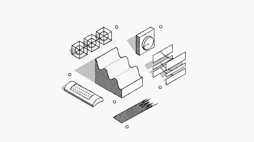

# 简介
这是一个面向对产品、运营、设计感兴趣人群的项目，内容包括：行业、业务、产品设计、运营方案思路、让生活变得更美好的工具、书籍、学习心得笔记等内容。

| 文章 | 分类 | 标签 |
|----|----|----|
|   [2020年，该如何用微信生态设计私域流量矩阵？](https://mp.weixin.qq.com/s/nQmKeKisQlVE-nnFPn67gw) |   运营 |     私领流量  |
